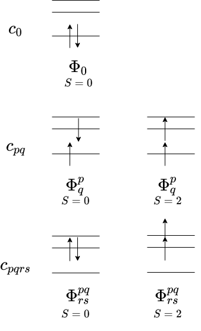
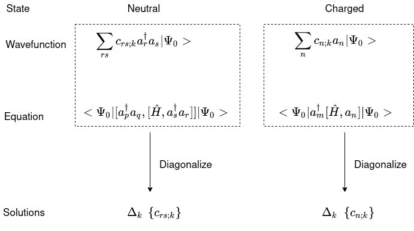

..
    : This file is part of EOMEE.
    :
    : EOMEE is free software: you can redistribute it and/or modify it under
    : the terms of the GNU General Public License as published by the Free
    : Software Foundation, either version 3 of the License, or (at your
    : option) any later version.
    :
    : EOMEE is distributed in the hope that it will be useful, but WITHOUT
    : ANY WARRANTY; without even the implied warranty of MERCHANTABILITY or
    : FITNESS FOR A PARTICULAR PURPOSE. See the GNU General Public License
    : for more details.
    :
    : You should have received a copy of the GNU General Public License
    : along with EOMEE. If not, see <http://www.gnu.org/licenses/>.

Equations-of-Motion
###################

Excites states

One approach to afordably include electron correlation in the
description of excited states is based on the Equations-of-Motion method (EOM).
In particular here we discuss the use of the ground state wavefunction’s low-order
electron-reduced density matrices.

Method:

The wavefunction of an :math:`(N \pm K)`-electron system in the kth
excited state (:math:`\Psi^{(N \pm K)}_k`) can be expressed in terms of
a reference state (:math:`\Psi^{(N)}_k`, usually taken as the ground
one, :math:`k=0`):

.. math::

    \left| \Psi^{(N \pm K)}_k \right> = \hat{Q}^{\pm K}_k \left| \Psi^{(N)}_0 \right>

where :math:`\hat{Q}^{\pm K}_k` is a transition operator that takes the
system from the reference to the target state. This constitutes the
EOM ansatze.

The excitations can be neutral, conserving the number of particles, or
charged, changing the number of particles from :math:`N`-electrons to
:math:`N \pm K`.

As is derived from above’s equation, :math:`\hat{Q}^{\pm K}_k` is
defined as:

.. math::
   \hat{Q}^{\pm K}_k = \left| \Psi^{(N \pm K)}_k \middle> \middle< \Psi^{(N)}_0 \right|

and should satisfy the “killer-condition”:

.. math::

   (\hat{Q}^{\pm K}_k)^\dagger \left| \Psi^{(N)}_0 \right> = 0

We can then expand :math:`\hat{Q}^{\pm K}_k` in terms of a linear
combination of creation/anihilation operator strings (a basis set).

As an example, the electron excitation operator would be:

.. math::

   \hat{Q}^{0}_k = c_0 + \sum_{pq} c_{pq;k} a^\dagger_p a_q + \sum_{pqrs} c_{pqrs;k} a^\dagger_p a^\dagger_q a_s a_r + ...

Which upon acting on a reference state :math:`\Phi_0` would generate
sets of configurations like the ones depicted bellow:

However, traditionaly, the most common approximations, truncate the
expansion at :math:`1^{st}` order:

.. math::

    \hat{Q}^{-1}_k &= \sum_n c_{n;k} a_n\\
    \hat{Q}^{+1}_k &= \sum_n c_{n;k} a^\dagger_n\\
    \hat{Q}^{0}_k &= \sum_n c_{pq;k} a^\dagger_p a_q\\
    \hat{Q}^{-2}_k &= \sum_n c_{pq;k} a_p a_q\\
    \hat{Q}^{+2}_k &= \sum_n c_{pq;k} a^\dagger_p a^\dagger_q

For simplicity, following on, we will adopt the general notation:

  .. math::

     \hat{Q}^{\pm K}_k = \sum_n c^{\pm K}_{n;k} \hat{q}^{\pm K}_n

to define the transition operator.

The Schrödinger equation for each state is:

.. math::

    \hat{H} \left| \Psi^{(N \pm K)}_k \right> = E^{N \pm K}_k \left| \Psi^{(N \pm K)}_k \right>

However, instead of above’s expression, we solve directly for the
transition energy (:math:`\Delta_k = E^{N \pm K}_k - E^{N}_0`) as:

.. math::

    \hat{H} \hat{Q}^{\pm K}_k \left| \Psi^{(N)}_0 \right>
        - \hat{Q}^{\pm K}_k \hat{H} \left| \Psi^{(N)}_0 \right>
        &= \Delta_k \hat{Q}^{\pm K}_k \left| \Psi^{(N)}_0 \right>\\
    \left[\hat{H}, \hat{Q} \right] \left| \Psi^{(N)}_0 \right>
        &= \Delta_{k} \hat{Q}^{\pm K}_k \left| \Psi^{(N)}_0 \right>

This is preferable as one can gain the advantages of systematic
cancellation of errors (since energy differences are evaluated) and the
operator :math:`\left[\hat{H}, \hat{Q} \right]` will usually be a
simpler (fewer-body) operator than :math:`\hat{H} \hat{Q}^{\pm K}_k`.

To find the transition energies and
:math:`\left| \Psi^{(N \pm K)}_k \right>` satisfying this equation one
can project on a set of arbitrary states.

Here, we use those defined by the basis set expanding
:math:`\hat{Q}^{\pm K}_k`, as is traditionaly done. This is a convenient
choise that will allow us to express the equations in terms of the
reduced density matrices for the reference wavefunction.

In this form one gets the EOM in its simplest form, stated as a
generalized eigenvalue problem:

.. math::

   \left< \Psi^{(N)}_0 \middle|
               \left( {q^{\pm K}_m} \right)^{\dagger} \left[\hat{H}, \hat{Q}^{\pm K}_k \right]
           \middle| \Psi^{(N)}_0 \right>
           = \Delta_{k} \left< \Psi^{(N)}_0 \middle|
               \left( {q^{\pm K}_m} \right)^{\dagger} \hat{Q}^{\pm K}_k
           \middle| \Psi^{(N)}_0 \right> \forall m

Asuming the fulfilment of the “killer condition”:

.. math::

   \left< \Psi^{(N)}_0 \middle| \hat{Q}^{\pm K}_k
           = \middle< \Psi^{(N)}_0 \right| \hat{H} \hat{Q}^{\pm K}_k = 0

Leads to the alternative formulations:

.. math::
   \left< \Psi^{(N)}_0 \middle| \left[
               \left( {q^{\pm K}_m} \right)^{\dagger}, \left[\hat{H}, \hat{Q}^{\pm K}_k \right]
           \right]_{\pm} \middle| \Psi^{(N)}_0 \right>
           = \Delta_{k} \left< \Psi^{(N)}_0 \middle|
               \left( {q^{\pm K}_m} \right)^{\dagger} \hat{Q}^{\pm K}_k
           \middle| \Psi^{(N)}_0 \right> \forall m\\
       \left< \Psi^{(N)}_0 \middle| \left[
               \left( {q^{\pm K}_m} \right)^{\dagger}, \left[\hat{H}, \hat{Q}^{\pm K}_k \right]
           \right]_{\pm} \middle| \Psi^{(N)}_0 \right>
           = \Delta_{k} \left< \Psi^{(N)}_0 \middle| \left[
               \left( {q^{\pm K}_m} \right)^{\dagger}, \hat{Q}^{\pm K}_k
           \right]_{\pm} \middle| \Psi^{(N)}_0 \right> \forall m

Provided the exact :math:`\hat{Q}^{\pm K}_k` and
:math:`\left| \Psi^{(N \pm K)}_k \right>` were known, this formulations
are exact. However, in practice, the approximations of
:math:`\hat{Q}^{\pm K}_k` listed above are used. With these definitions
only the one- and two-electron reduced density matrices are required to
solve the eigenvalue equations.

Finally, different wavefunction ansätze can be used to define
:math:`\left| \Psi^{(N)}_0 \right>`, though commonly, a single Slater
determinant has been used.

Matrix representation:

.. math::
    \sum_{n} \left< \Psi^{(N)}_0 \middle|
            \left( {q^{\pm K}_m} \right)^{\dagger} \left[\hat{H}, \hat{q}^{\pm K}_n \right]
        \middle| \Psi^{(N)}_0 \right>
        c^{\pm K}_{n;k} &= \Delta_{k} \sum_{n} \left< \Psi^{(N)}_0 \middle|
            \left( {q^{\pm K}_m} \right)^{\dagger} \hat{q}^{\pm K}_n
        \middle| \Psi^{(N)}_0 \right> c^{\pm K}_{n;k} &\forall m \\
        \mathbf{A} \mathbf{c} &= \Delta_{k} \mathbf{B} \mathbf{c} &

Example for electron excited and ionized states of what this code does

